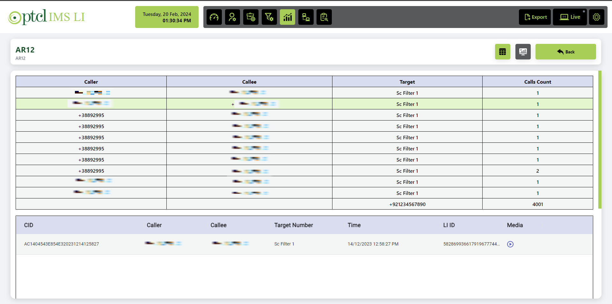

# Project Title
Lawful Interception

## Introduction
Lawful Interception is a project that encompasses various advanced development and integration tasks:

## Features
- **Responsive Web Apps**: Developed using React.js.
- **Role-Based Website**: Enhanced user engagement through Keycloak.
- **Microservices Architecture**: Built with Java and Node.js.
- **Real-Time Processing**: Implemented using Apache Kafka.
- **Database Management**: Designed MongoDB schemas and migrated from MySQL to MongoDB.
- **Scalability and Performance**: Achieved using Spring Framework and Java.
- **Security**: Enforced with SSL certificates and robust user authentication.

## Diagram
Here is a diagram explaining the project structure:

### Dashboard
Graphs that are for the specific user logged in:

### Keycloak
User management system:

### Login Page
The login page:

### Analysis Page
The analysis page:

### Analysis Graph
The analysis graph:

### Analysis Table
The analysis table:

Additionally, the project includes many more features and pages such as live monitoring, main-case subcase creation, auditing folder hierarchy, and more.

## Conclusion
Lawful Interception is a comprehensive project that integrates various technologies and methodologies to create a scalable, secure, and user-friendly web application. The diagrams above provide a visual representation of different parts of the project, while the features list highlights the key components and functionalities.
